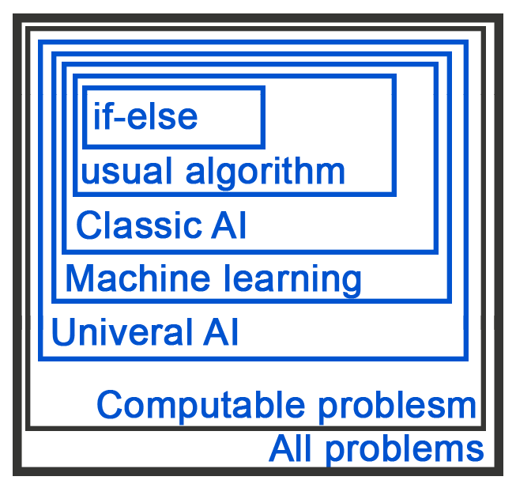

# Description

This part will be covering the main ideas about what the word Artificial intelligence means, why should we care and in
what ways has it been categorized.\

# TA Material

### Practicality

Every **solvable problem** comes with a set of **practical restrictions**. These restrictions are usually economical in
nature and include:

1. **Time Complexity**: if a program requires more **run time** than the user (e.g. business) is willing to wait, it's
   not practical.
2. **Space Complexity**: if a program requires more **memory** than the user (e.g. business) has set aside, it's not
   practical.
3. **Development Cost**: if a program requires more **development hours and costs** than the user (e.g. business) is
   willing to spend, it's not practical.

To illustrate this, take a simple if-else program. you can solve some problems in a practical way with these kinds of
programs. For example, You can write a very efficient if-else program in a reasonable time that would solve
Tic-Tak-Toe.

- Do note that these practical restrictions are a moving target.\
  The "reasonable" time and space complexity and dev costs for a problem would change over time.\
  For example, Producing a game like GTA V in the 1950s would be an insane project, both financially and technically.
  but now, with better hardware, a blooming gaming industry and simpler programing procedures, it has become a viable
  problem to solve.

### AI in the context of problem-solving

It might be better to think of AI from a problem-solving lenses. By this we mean that AI, much like if-else programs,
is just a way of thinking about an algorithm.\
The difference is that AI algorithms, unlike other, are not tailored around a specific problem.\

To explain this, we'll try to classify problems based on what's the simplest program that can solve them in a practical
way.\
To visualize this, let's take a look at the following (carelessly made) diagram:

* This diagram is not accurate and is just for illustration purposes. for starter, these subset might be not
  mutually exclusive.

* These subsets are not clear-cuts and the lines that separate them are sometimes blurry.
* There might be more subsets.
  For starters, we must note that according to Gödel's theorems, there are problems that are not solvable by any
  program.\
\
  The solvable problems are divided into 5 categories.

1. **if-else** solvable problems: if-else code is essentially a complex array where the index is the input and the
   value is the value of that element. e.g. lowercase letter to uppercase letter (w -> W).
2. **Usual Algorithm**: Any program that exploits a set of facts to solve only one specific problem.\
   e.g. any sorting algorithm. to illustrate this even further, think of Split Sort which uses the fact that 'if a<b,
   b<c then a<c' to sort a list of numbers. (it sorts around one element, and then splits the list into two parts and
   repeats)
3. **Classic AI**: The majority of this course will be discussing these Classic AIs. These are the first kinds of AI to 
   be created. They are usually some sort of search algorithm.\
   The important thing is that they are pre-writen and are not tailored to a specific problem and can solve a large set
   of problems. These algorithms exist independently of the problem.\
   e.g. BFS/DFS search algorithm, Genetic algorithm, etc. Take DFS which would be able to solve tic-tac-toe; You only
   need to somehow tell DFS how tic-tac-toe is played.\
   the way to show DFS (and others) how to play tic-tac-toe to give them 3 methods:
    * win(state): check if it has won the game or not.
    * possible_moves(state): return a list of defined and legal (e.g. if you lose, you can't act anymore) moves.
    * make_move(state, action): returns a new state where the action has taken place on the input state.
   an extra method called the heuristic function might also be needed for more complex problems which brings Classic AI
   closer to Usual Algorithm in many ways.
4. **Machine Learning**: Like Classic AI, these alg. are pre-writen and are not tailored to a specific problem. but they
   don't solve the problem directly. instead they create (or modify) another alg. (model) to solve a specific problem.\
   e.g. Backprob. with Gradiant Decent paired with Neural Networks. Backprob. with Gradiant Decent modifies the Neural
   Networks in a fashion to tailor it for a specific problem. modifying another alg. might not be true machine learning,
   but it has proven to be extremely useful.
5. **Universal AI**: also called general AI, are able to create all the above algorithm. We know such an alg. exist. our
   brain is such a machine. but we have no idea how it is made, but we do have hints. our brain is a huge neural network
   which means that a Universal AI should also be a neural network.\

#### Some conclusions

* While in Usual Algorithm and if-else we tend to directly think about the solution process of a problem, in AI we tend
  to think about how to describe a problem to a machine and which alg. best solves the problem.\
* Some Classic AI alg. look like a template for other Usual Algorithm. take the DFS which looks like a template for
  dynamic programming style of writing a software.\
  but the difference is that DFS is an alg. that can solve a large set of problems. while dynamic programming is a way
  of thinking about a problems' solution.\

### AI and practicality

With the subsets described above in mind, we can now analyse how practicality is affected by the type of alg. used.\

#### Information required to solve a problem

1. **if-else**: requires everything. You must be an omniscient in regard to the problem. This is easy for simple problems
   like tic-tac-toe, but not for complex problems like chess or cat image recog. problem.
2. **Usual Algorithm**: requires some particular fact that can be exploited to solve a problem in an automated way.\
   e.g. the fact that if a<b, b<c then a<c can be used to sort a list of numbers.\
   This is easy for problems like sorting a list, but not for problems like chess or cat image recog. problem.
3. **Classic AI**: requires only the description of a problem, like the basic rules that define the problem and
   what a solved state looks like; sometimes other information and estimates are also needed.\
   e.g. problems like sudoku can be described with win(state), possible_moves(state), make_move(state, action)
   methods. chess requires an extra heuristic function which usually is an estimate of victory likelihood.
   but these are not true for the cat image recog. problem where even the rules are not clear.
4. **Machine Learning**: requires a huge set of examples of the problem (usually paired with their solutions) in clear and
   structured fashion.\
   e.g. you can train a neural network to recognize a cat image; but this is not possible for problems that don't have
   clear and structured data in huge numbers, like judicial and business decision-making.\
5. **Universal AI**: We don't really know what it would need. but if we take humans as such a machine, then it would
   require a bit of everything. the important thing is that structured data and huge numbers might not
   be a requirement and such machine would do what a data analyst does automatically.\
   This might mean that backprob and similar alg. are less useful for Universal AI as they require structured data; but
   many neural networks have recently (past few months) been able to learn from less structured data
   and mixed data types.\

#### Human and Economic requirements to solve a problem

1. **if-else**: While tic-tac-toe can be written by one person and requires a simple machine to run, chess requires
   a huge amount of human effort to write. You have to be the top chess master for starters, and you also need an 
   unholy amount of time and disk space to write all the states; and checking every state requires a powerful machine.\
   Problems as simple as sorting a list are not possible in this fashion as they would require infinite number of lines 
   as possible inputs are endless. at least for chess, if you really have to, if-else can be done with millions of 
   humans working in parallel to map all the paths.
2. **Usual Algorithm**: requires a group of people who have a good grasp over the problem and its solutions.\
   e.g. sorting a list of numbers can be writen by one person, and it only requires basic understanding of math.\
   The same can not be said for chess where there are no practical facts to exploit.\ 
   even for simpler problems like sudoko, if someone attempts to write such an alg. it would be very long and 
   would resemble an if-else alg. with similar states being classified as the same state.
   The computation power required is also very dependent on the people solving it.\
3. **Classic AI**: Many problems can be described by a few rules and as a result, can easily be solved by such machines;
   but the computational power is unimaginable. to fix this, a heuristic of some sort could be used to reduce the search
   but this means that the developer must also know more about the problem but doesn't need to know everything.\
   For sudoko, you only have to write the rules of the game. but for chess, the developer must have some 
   understanding of how well a game is going, otherwise the program might require a supercomputer to run.\
4. **Machine Learning**: The main requirements are many structured data, which means a lot of manpower spend on 
   gathering and cleaning the data. After that, a model must be developed which has its own difficulties regarding the
   size of the data and the computational power available to train the model.\
   There are many cat images and pixels are easy to structure. The models are also well known and the GPU power is 
   cheap, so this is not a very hard problem. but for problems like judicial and business decision-making, the data
   is both unstructured and too little to train a model. and even then, a model that can use these kinds of data are
   not well known and require a lot of research and development.\
5. **Universal AI**: Only God knows at this point, but human brains seems to require little computational power 
   and even less data to work. We expect that once one is built, the process of making more would most likely be easy.\

#### Some conclusions
* We don't really know if Universal AI can solve all the problems, or if we'll reach a maximum complexity that
  is impossible to solve. Currently, computation theory suggests that some problems are of extreme nature
  and can not be solved or even estimated in any capacity. but since human brains have come so far, if a Universal AI is
  made, we can expect it to make better Universal AI's which might mean exponential growth in solving complexity.\
